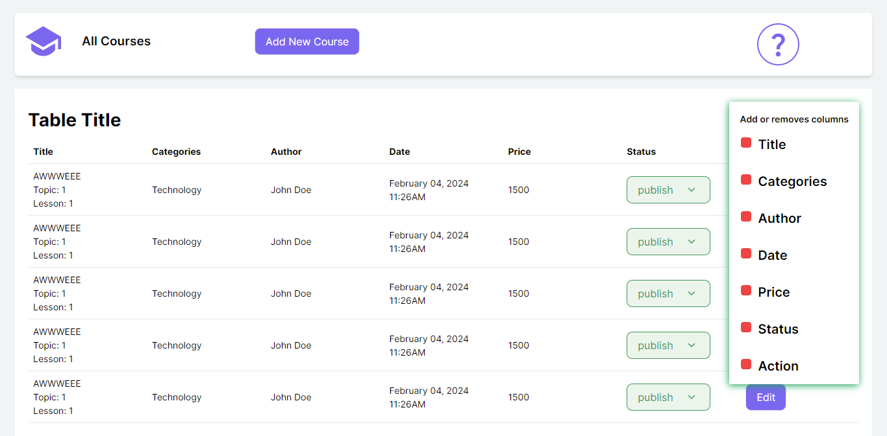
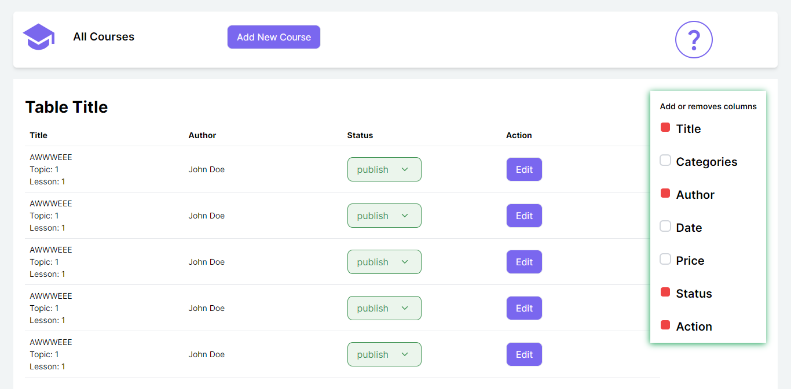
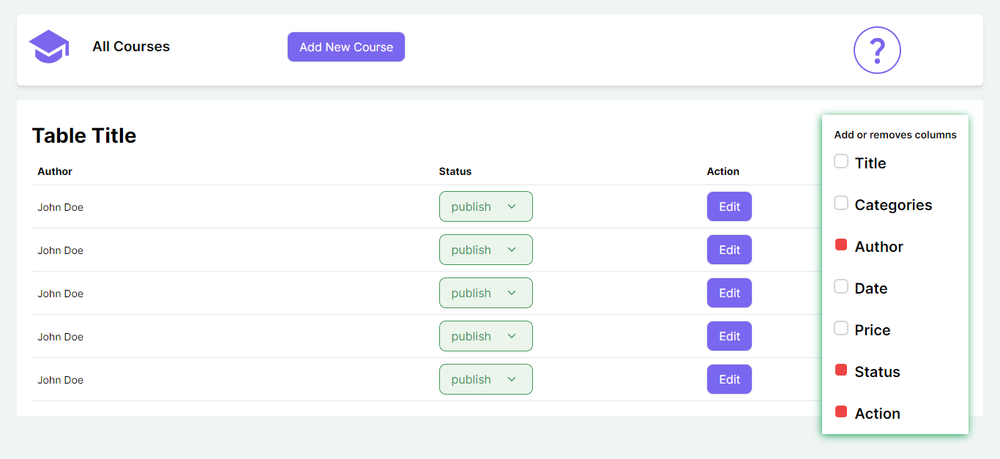
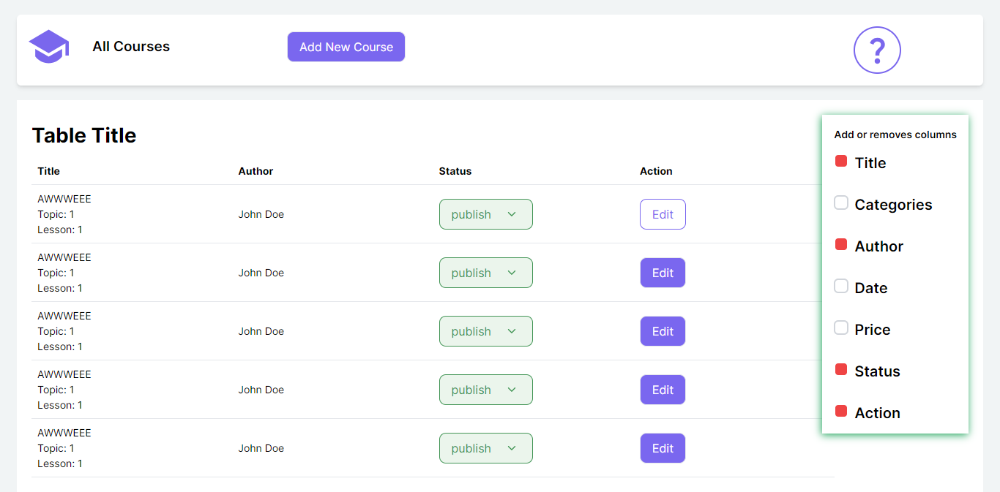

## Key Technologies

**Client-Side:** Next js, TailwindCSS

**Language:** TypeScript

**Documentation**: React-StoryBook

## Demo

- **When All Field are checked**
  

- **When Title, Author, Status and Action are checked**
  

- **When Title has unchecked**
  

- **When Title has again checked**
  

## Run Locally

Clone the project

```bash
  git clone https://github.com/SYShopnil/TechnoFix-Task.git
```

Go to the project directory

```bash
  cd
  TechnoFix-Task
```

Install dependencies

```bash
  npm install || npm i
```

Start the server

```bash
  npm run dev
```

Start the StoryBook

```bash
  npm run storybook
```

## Installation

Install my-project with npm

```bash
  npm install || npm i
```

## Support

For support, sadmanishopnil@gmail.com
